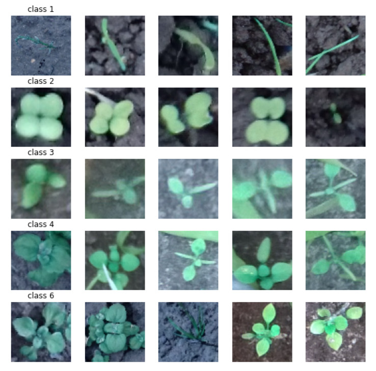
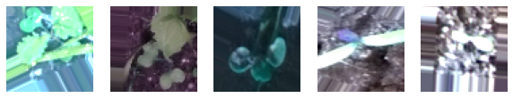

# Applying Regularization and Data Augmentation on CNN Model to Image Classification (Leaf counting dataset)
## Description:
- This project used the Leaf counting dataset that contains plants with approximatelty 1,2,3,4 and 6 leafs as shown in the followed figure that cantains some samples for each class.

The link of the Leaf counting dataset: https://vision.eng.au.dk/leaf-counting-dataset/

- This project used Pretrain model that is called VGG-16. When applying a classification network to a pre-trained VGG-16 model that had been trained by plants' dataset, its figure curve of accuracy showed that it had overfitting because the training accuracy score on each epoch was 100% and the validation and testing accuracy scores were 27.2% and 23%, respectively. And when applying regression reformulation to it, it had underfitting because its figure curve of accuracy on each epoch showed that training and validation were very bad.

- When using data Augmentation, the dataset was added new images as shown in the following figure.

- 

- When regularisation (dropout and batch normalisation) was applied to the pretrain model (preVGG16_R), it overfit again because training accuracy was very high and validation accuracy was very low on its curve figure, requiring more layers through regularization. And when using data augmentation on it, its curve figure showed that it had underfitting on each epoch because the accuracy of training and validation were very low, so the dataset will need more images for each class and more layers.

## References
[1] N. Teimouri, M. Dyrmann, P. R. Nielsen, S. K. Mathiassen, G. J. Somerville, and R. N. Jørgensen, “Weed growth stage estimator using deep convolutional neural networks,” Sensors, vol. 18, no. 5, 2018.

